# WorkTracker Pro

### FPT Aptech — Capstone Project

**Tech Stack**: Django 5.2, Django REST Framework 3.17, PostgreSQL, Django Channels + Daphne, Celery + Redis, React 19 (Vite), TanStack Query & Table, Zustand, Tailwind CSS v4

## Team Members

Tang Huynh Tuan Tu - Student1685504  
Tran Le Minh Anh    -   Student1686151  
Nguyen Duc Long    -  Student1685473

## Project Overview

**WorkTracker Pro** is a role-based enterprise work management system that lets companies manage clients, projects (Jobs), assign tasks, track daily working hours, and review team performance — all inside a single permission-controlled platform split across three roles:

- **Admin** — company-wide governance: clients, users, departments, timesheet control, audit trail
- **Manager** — owns a scoped set of Jobs: Kanban board, task QA review, timesheet approval, period locking, team workload
- **Employee** — personal execution workspace: My Tasks, Timesheet, My Performance, Team Chat

Every state-changing action (task transitions, timesheet edits, account changes, period locks) goes through a dedicated service layer enforcing business rules server-side — the frontend only reflects what the backend already allows.

## Screenshots

### Sign In

<p align="center">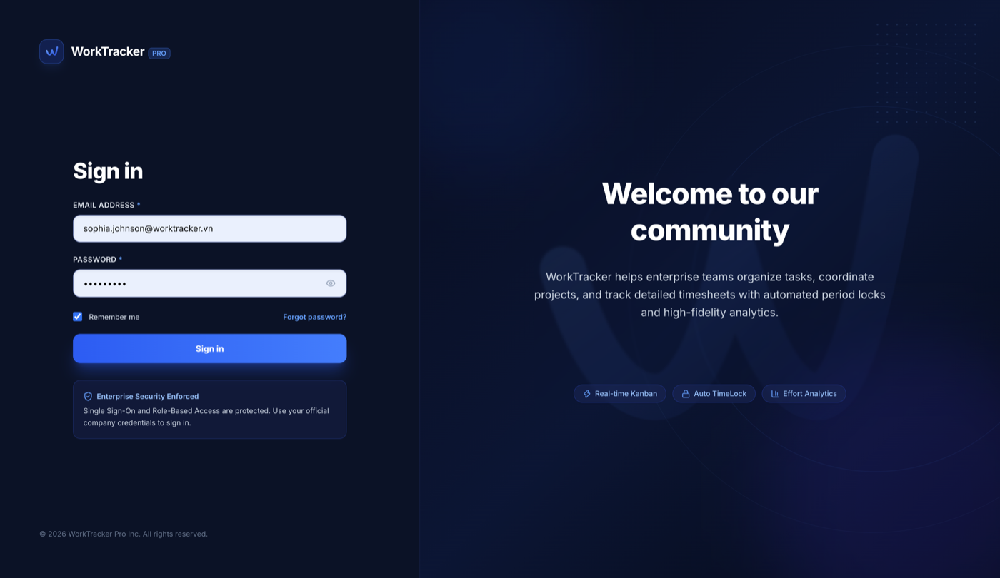</p>

### Shared Across Roles

<table>
<tr>
<td align="center" width="33%">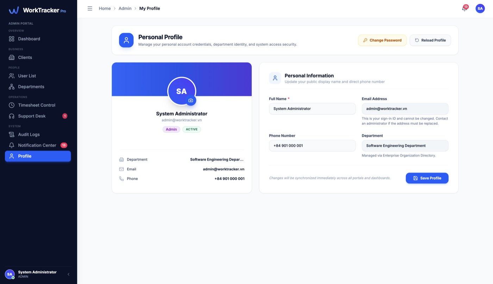<br><sub><b>Profile</b></sub></td>
<td align="center" width="33%">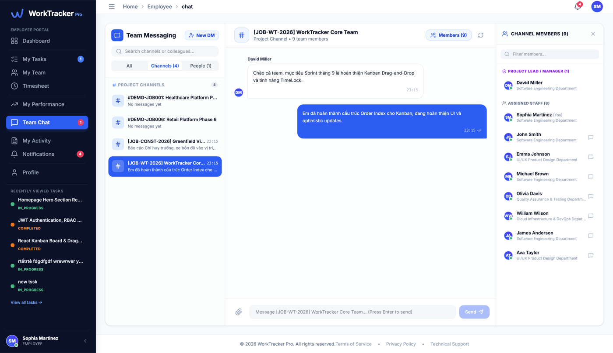<br><sub><b>Team Chat</b></sub></td>
<td align="center" width="33%">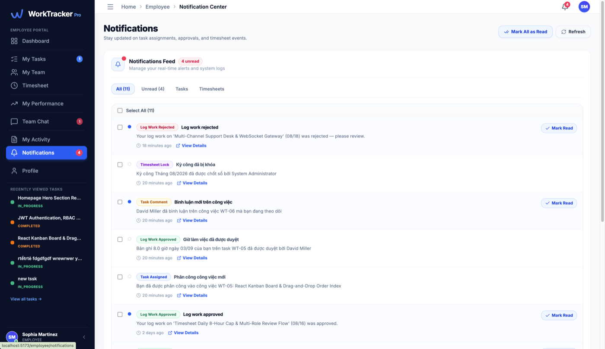<br><sub><b>Notifications</b></sub></td>
</tr>
</table>

### Admin

<table>
<tr>
<td align="center" width="50%">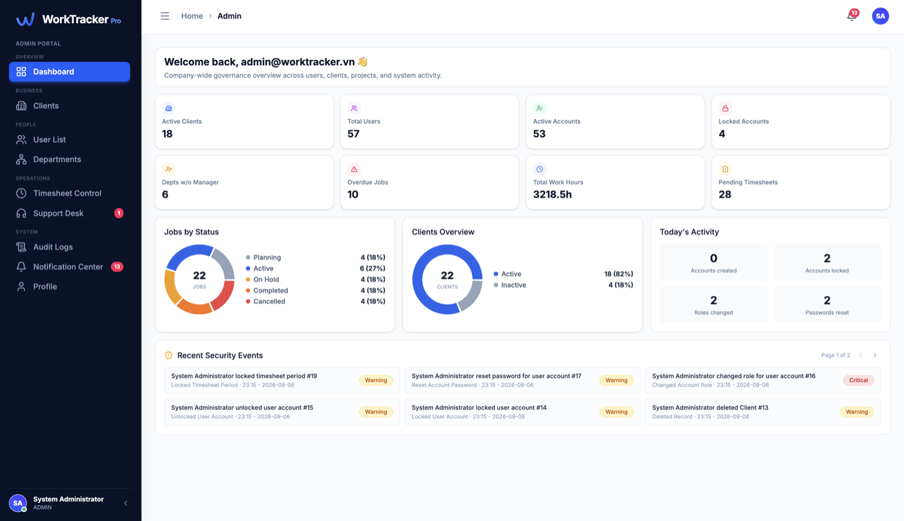<br><sub><b>Dashboard</b></sub></td>
<td align="center" width="50%">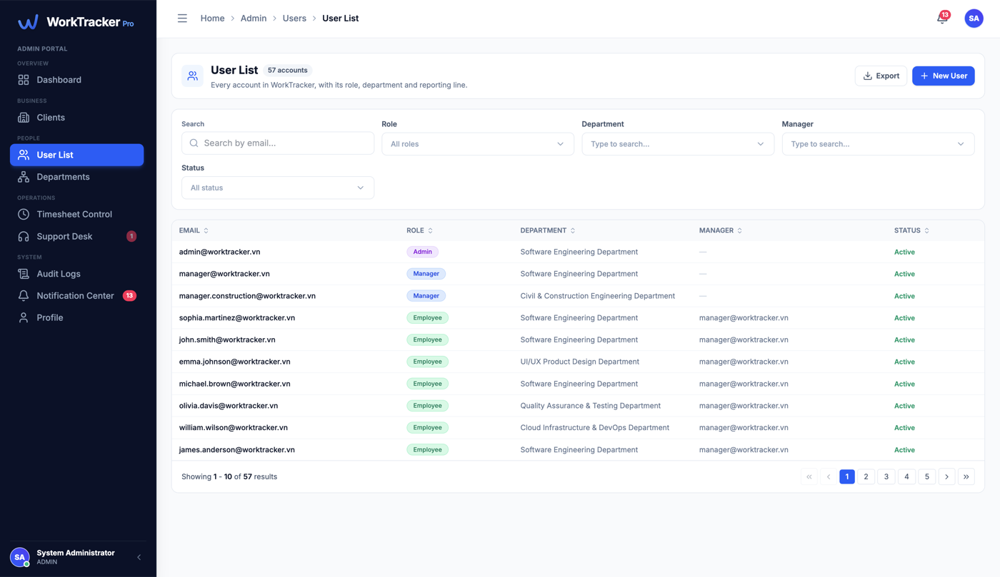<br><sub><b>User List</b></sub></td>
</tr>
<tr>
<td align="center">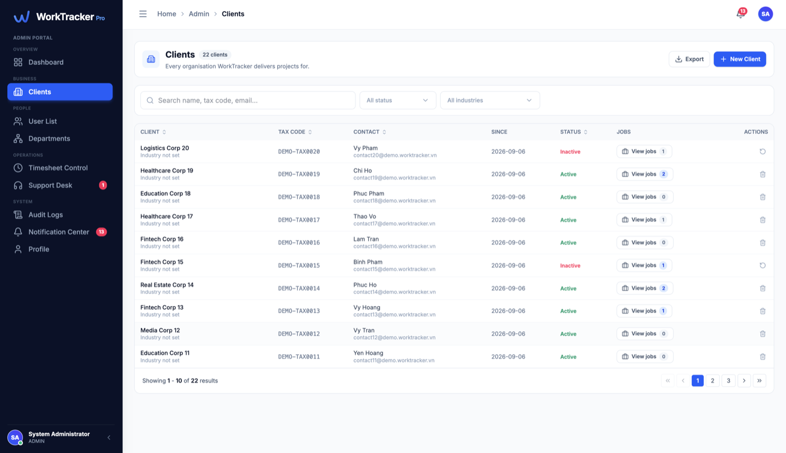<br><sub><b>Clients</b></sub></td>
<td align="center">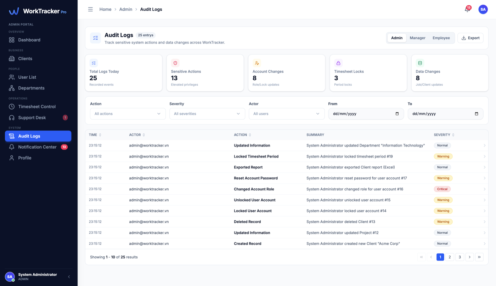<br><sub><b>Audit Logs</b></sub></td>
</tr>
</table>

### Manager

<table>
<tr>
<td align="center" width="50%">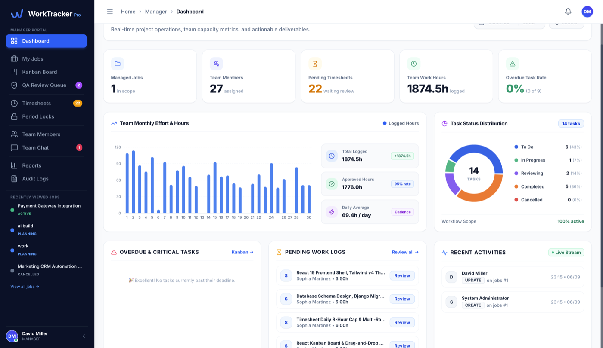<br><sub><b>Dashboard</b></sub></td>
<td align="center" width="50%">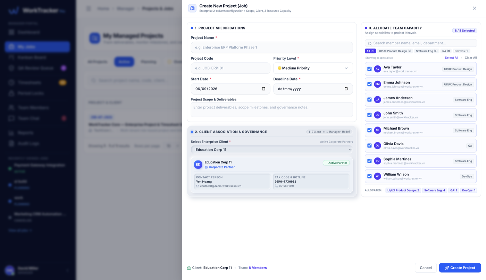<br><sub><b>Create Project (2-column enterprise form)</b></sub></td>
</tr>
<tr>
<td align="center">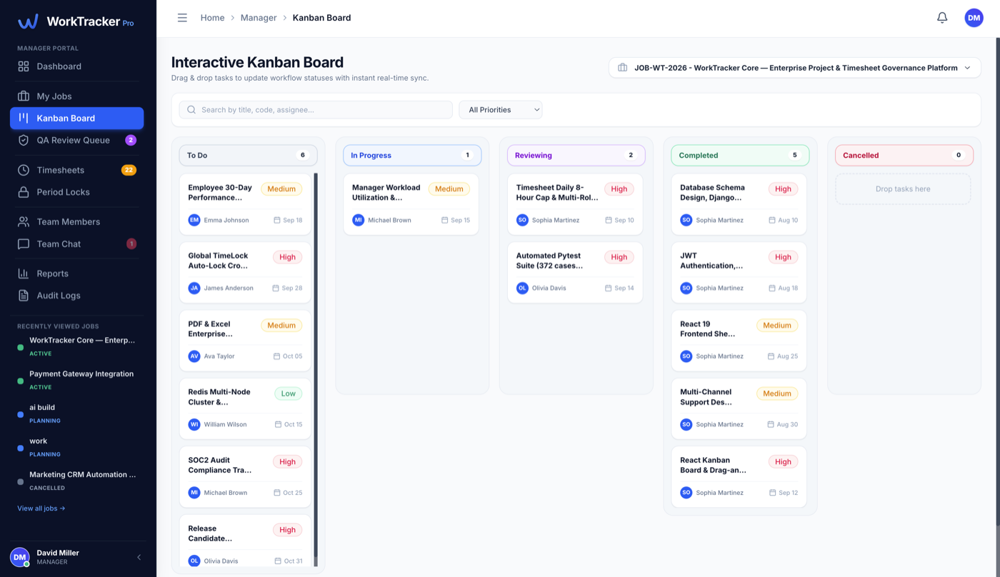<br><sub><b>Kanban Board</b></sub></td>
<td align="center">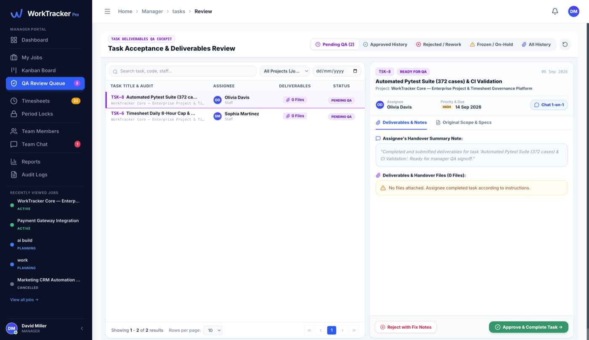<br><sub><b>QA Review Queue</b></sub></td>
</tr>
</table>

### Employee

<table>
<tr>
<td align="center" width="50%">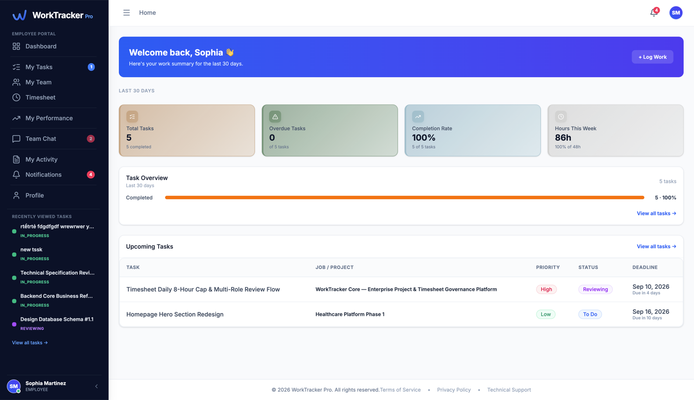<br><sub><b>Dashboard</b></sub></td>
<td align="center" width="50%">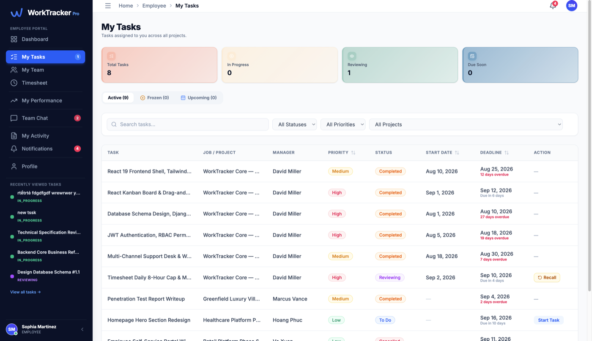<br><sub><b>My Tasks</b></sub></td>
</tr>
<tr>
<td align="center">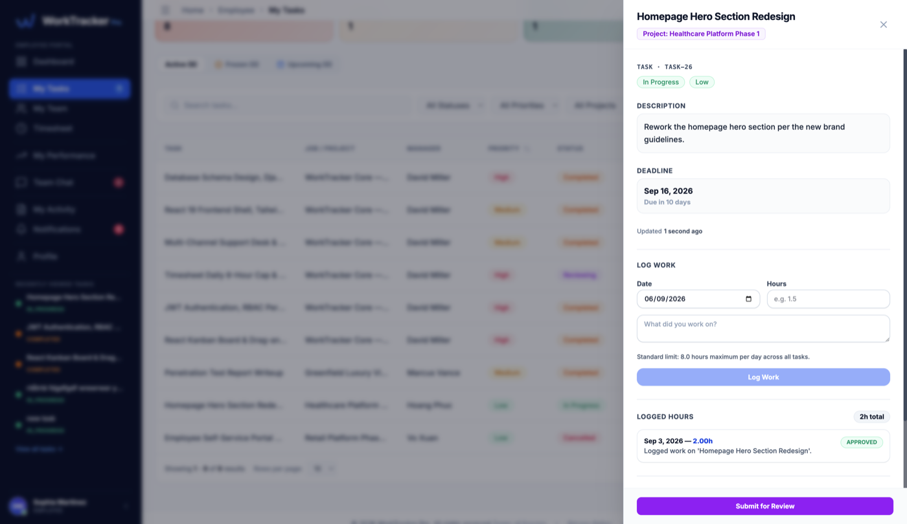<br><sub><b>Task Detail Drawer</b></sub></td>
<td align="center">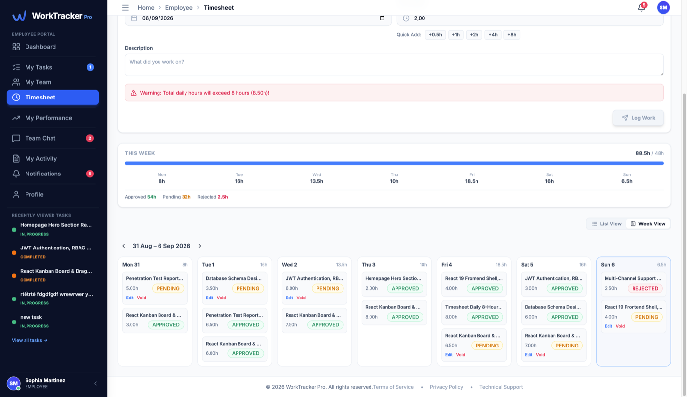<br><sub><b>Timesheet (Week View)</b></sub></td>
</tr>
<tr>
<td align="center">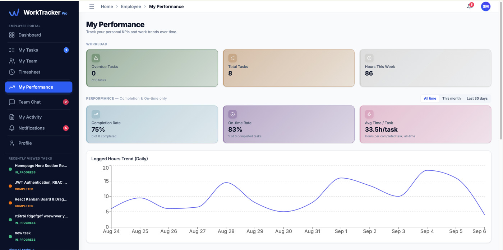<br><sub><b>My Performance</b></sub></td>
<td></td>
</tr>
</table>

## API Documentation

Auto-generated OpenAPI 3.0 schema via `drf-spectacular`, served at `/api/docs/` (Swagger UI) once the backend is running.

## Key Features

### Public & Core Auth
- JWT authentication (`djangorestframework-simplejwt`) with access/refresh tokens
- Instant account revocation — active-status check cached in Redis and re-validated on every request, so a locked account's existing token stops working immediately, not just on next login
- Forgot / Reset password via email (SMTP), password-strength rules enforced both client and server side
- Show/hide toggle on every password field
- Role-based redirect after login (Admin / Manager / Employee land on their own portal)

### Admin — System Governance
- **Dashboard** — active clients, total/locked accounts, jobs by status, clients overview, today's account-security activity
- **Clients** — full CRUD, soft-delete only (`is_active=False`, never hard-deleted)
- **User List** — create/search/filter accounts by role, department, manager, status; forced password change on first sign-in
- **Departments** — organisational units with an accountable manager
- **Timesheet Control** — company-wide monthly compliance view per employee (hours logged vs. expected, over-limit flags) and **GLOBAL period lock** (freezes LogWork edits company-wide for payroll close)
- **Support Desk** — internal support ticket inbox
- **Audit Logs** — immutable trail of every sensitive action (role changes, password resets, locks, deletes) with severity levels
- **Notification Center** — persisted, real-time system notifications

### Manager — Orchestration & Review
- **Dashboard** — managed jobs, team members, pending timesheets, monthly effort chart, task status distribution, live activity feed
- **My Jobs** — create/manage projects with a 2-column enterprise form (client governance + team capacity allocation), 1 Client = 1 Manager model
- **Kanban Board** — drag-and-drop task board (`@dnd-kit`) with instant reorder, backed by lexicographical `order_index` so reordering never triggers a bulk DB update
- **QA Review Queue** — inspect submitted deliverables and handover notes, then Approve & Complete or Reject with mandatory fix notes (task returns to `IN_PROGRESS`)
- **Timesheets** — daily cockpit to approve/reject/adjust each LogWork entry, or approve an entire day at once
- **Period Locks** — lock/unlock a completed month **per Job**, independent of the Admin's company-wide lock; blocked while pending logs remain
- **Team Members** — real-time workload capacity per person (assigned tasks, hours/day, Overloaded/Balanced/Available)
- **Reports & Analytics** — task delivery summary and detailed timesheet effort, exportable to Excel (`openpyxl`) or PDF (`xhtml2pdf`)
- **Team Chat** — project-scoped channels + direct messages, real-time via WebSocket
- **Audit Logs** — manager-scoped activity trail

### Employee — Execution Workspace
- **Dashboard** — last-30-day KPI window (total/overdue tasks, completion rate, hours this week), task status breakdown, upcoming tasks
- **My Tasks** — Active / Frozen / Upcoming tabs (Frozen = parent Job on hold or client deactivated; Upcoming = Manager-scheduled `start_date` still in the future); client-side search/filter/sort
- **Task detail drawer** — comments, work-log history, attachments, and the `TODO → IN_PROGRESS → REVIEWING` submission flow (self-approval blocked; Manager must QA-approve to reach `COMPLETED`)
- **Timesheet** — quick-log form with hour presets, List/Week views, Edit and Void (soft-delete, reason required) on pending entries — both gated by ownership, entry status, and period lock
- **My Performance** — completion rate, on-time rate, logged-hours trend, hours-by-project breakdown, per-task detail table
- **My Team** — read-only view of every project the employee is part of and who else is on it
- **Team Chat** — same real-time messaging as Manager, scoped to the employee's own project channels
- **Notification Center** — persisted feed, real-time push over WebSocket, mark-as-read
- **My Activity** — personal audit trail with before/after field diffs
- **Profile** — update display name/phone, change password

## Key Business Rules

- **Soft delete only** — Clients and users are never hard-deleted (`is_active=False` preserves history)
- **Immutable LogWork history** — entries are never deleted; mistakes are corrected via Edit (reason required) or marked `VOIDED` via Void (reason required), never removed
- **2-layer period lock** — `GLOBAL` (Admin, company-wide) and `JOB` (Manager, per project) locks are checked independently before any LogWork create/edit/void
- **Daily hours cap** — a user's total logged hours for one calendar day cannot exceed 8.00h, recomputed server-side with row-level locking (`select_for_update`) to survive concurrent requests
- **State machine, not free-form status** — every task transition is validated against an explicit `TASK_TRANSITIONS` table with role-aware actors (assignee / manager / admin), not just toggled from the client
- **Frozen project guard** — no task on a Job that is `ON_HOLD`/`CANCELLED`, or whose Client is deactivated, can change status (except cancelling)

## Project Components

- **Backend**: Django 5.2 + Django REST Framework (REST API, service-layer business rules, JWT auth)
- **Real-time**: Django Channels 4.2 + Daphne (ASGI) + Redis channel layer — `ws/notifications/` and `ws/chat/<room_id>/`
- **Async tasks**: Celery 5.6 + Redis broker + `django-celery-results` — background email dispatch, scheduled period auto-lock
- **Database**: PostgreSQL
- **Frontend**: React 19 (Vite) — plain JSX, no TypeScript — TanStack Query (server cache) + TanStack Table, Zustand (client state), Radix UI primitives + Tailwind CSS v4, recharts, `@dnd-kit` (Manager Kanban only)

## Monorepo Structure

```
worktracker-django-react/
├── backend/                ← Django REST API server (port 8000)
│   ├── accounts/           ← auth, users, roles/permissions, employee/manager/admin sub-apps
│   ├── projects/           ← Clients & Jobs
│   ├── tasks/              ← Task state machine, attachments, comments
│   ├── timesheets/         ← LogWork, DailyUserTimesheet, TimeLock
│   ├── chat/                ← Team Chat (WebSocket)
│   ├── reports/            ← Excel/PDF export
│   ├── system/             ← audit log, notifications (WebSocket)
│   └── worktracker_core/   ← settings, urls, asgi (Channels), celery
├── frontend/               ← React 19 SPA (port 5173)
│   └── src/
│       ├── pages/          ← admin/ manager/ employee/ auth/
│       ├── components/     ← shared + per-role UI
│       ├── hooks/queries/  ← TanStack Query hooks, per role
│       ├── api/            ← axios client + endpoint modules
│       ├── stores/         ← Zustand stores
│       └── utils/
└── docs/screenshots/       ← images used in this README
```

## Installation & Usage Guide

### Requirements

- Python 3.11+
- PostgreSQL 14+
- Redis 6+ (cache, Channels layer, Celery broker)
- Node.js 18+

### Backend Setup

```bash
cd backend

# Create & activate a virtual environment
python -m venv .venv
source .venv/bin/activate      # Windows: .venv\Scripts\activate

# Install dependencies
pip install -r requirements.txt

# Configure environment
cp .env.example .env           # then fill in DB credentials, SECRET_KEY, SMTP, etc.

# Run migrations
python manage.py migrate

# Seed roles/permissions, then demo data
python manage.py seed_roles
python manage.py seed_data --reset

# Run the development server (make sure PostgreSQL & Redis are running)
python manage.py runserver

# Optional: async email / scheduled locks
celery -A worktracker_core worker -l info
```

### Automated Tests (Pytest)

```bash
cd backend
python -m pytest
```

### Frontend Setup

```bash
cd frontend
npm install

# Point the SPA at the backend
echo "VITE_API_BASE_URL=http://localhost:8000" > .env

npm run dev
```
