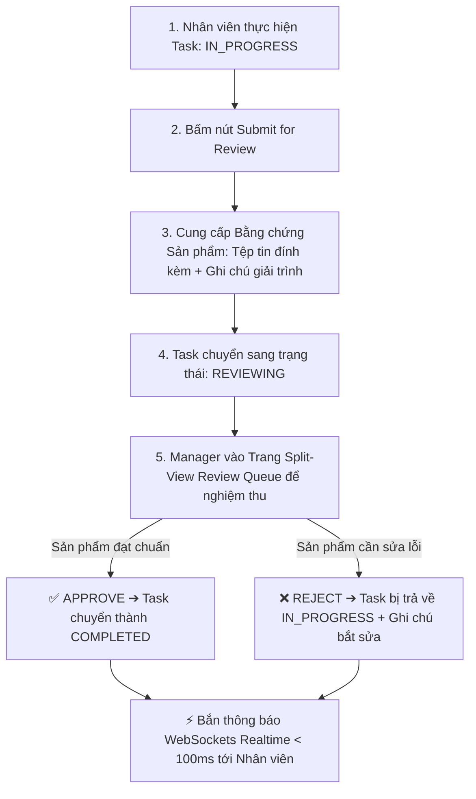

# 📑 BÁO CÁO ĐẶC TẢ NGHIỆP VỤ & KIẾN TRÚC TOÀN DIỆN
## HỆ THỐNG QUẢN TRỊ TIẾN ĐỘ, NGHIỆM THU SẢN PHẨM & CỘNG TÁC ĐỘI NGŨ (WORKTRACKER PRO)

> **Tài liệu tham chiếu chuẩn:** Dành cho Ban Giám đốc, Quản lý Dự án (Project Manager), Đội ngũ Phát triển (Dev/Frontend/Backend) và Chuyên viên Phân tích Dữ liệu (Data Analyst).

---

## 🧭 PHẦN 1: ĐỊNH VỊ VÀ RANH GIỚI HỆ THỐNG (SYSTEM SCOPE & BOUNDARIES)

### 1.1. Bản chất cốt lõi của WorkTracker Pro
WorkTracker Pro là nền tảng chuyên sâu về **Quản trị Tiến độ Dự án (Project Delivery)**, **Đo lường Nỗ lực Thực tế (Effort Tracking)** và **Đảm bảo Chất lượng Nghiệm thu Đầu ra (Deliverable Quality Assurance)**.

### 1.2. Ranh giới sản phẩm (Product Boundaries)
- ❌ **KHÔNG PHẢI là phần mềm chấm công tính lương (Payroll)**: Hệ thống không dính líu đến quy chế tính lương, thuế TNCN, bảo hiểm hay chính sách phụ cấp của phòng HR/Kế toán.
- ✅ **LÀ hệ thống đo lường dữ liệu thực thi dự án**: Cung cấp số liệu chính xác cho Ban Giám đốc, Project Manager và bộ phận Phân tích Dữ liệu (Data Analyst) về:
  1. *Thời lượng thực tế để hoàn thành từng Task (Actual Duration vs Estimated Time).*
  2. *Tổng số nhân lực và tổng giờ công đã đổ vào mỗi Dự án (Total Project Effort).*
  3. *Tốc độ làm việc và năng lực thực thi của từng nhân sự (Team Velocity & Utilization).*

---

## 🎯 PHẦN 2: TẦNG 1 — BÀN GIAO & NGHIỆM THU SẢN PHẨM ĐẦU RA (TASK DELIVERABLES QA)



### 2.1. Quy trình Nộp Sản Phẩm An Toàn (Safe Deliverable Submission)
Khi nhân viên hoàn thành công việc trên một Task:
1. Nhân viên bấm **"Submit for Review"** (Chuyển trạng thái sang `REVIEWING`).
2. **Cung cấp Bằng chứng Sản phẩm (Deliverable Submission)**:
   - 📎 **Tệp tin sản phẩm đính kèm (Trọng tâm chính)**: Tải file kết quả trực tiếp từ máy cá nhân lên server (`.zip`, `.rar`, `.pdf`, `.docx`, `.xlsx`, `.png`, `.jpg`).
     - *Lưu trữ vật lý*: Thư mục server `media/attachments/` (hoặc Cloud Storage).
     - *Lưu trữ cơ sở dữ liệu*: Bảng `task_attachments` (`file_name`, `file_url`, `file_size`, `uploaded_at`, `user_id`).
     - *An toàn thông tin*: Không dùng link web lạ bên ngoài nhằm triệt tiêu hoàn toàn nguy cơ lừa đảo (Phishing) hoặc mã độc (Malware).
   - 📝 **Văn bản tóm tắt bàn giao (Handover Summary)**: Nhân viên mô tả ngắn gọn kết quả đạt được và hướng dẫn kiểm thử.
     - *Lưu trữ cơ sở dữ liệu*: Bảng `task_comments` với loại `comment_type = 'SUBMISSION_NOTE'` để bảo toàn lịch sử mọi lần nộp bài.

### 2.2. Màn Hình Nghiệm Thu Tập Trung (Split-View Review Queue)
Manager không cần bấm mở từng modal/tab phức tạp mà làm việc trên **Trang Nghiệm Thu Tập Trung**:
- **Cột Trái (35% Chiều rộng)**: Danh sách các Task đang ở trạng thái `REVIEWING` (Tên task, Người làm, Dự án, Mức độ ưu tiên, Thời gian nộp).
- **Cột Phải (65% Chiều rộng)**: Khung Nghiệm thu Tập trung:
  - Tải **File sản phẩm đính kèm** về kiểm tra trực tiếp.
  - Đọc **Tóm tắt bàn giao & Hướng dẫn test** của nhân viên.
  - **2 Nút Quyết định To Rõ**:
    - **`✅ APPROVE & COMPLETE`**: Phê duyệt nghiệm thu ➔ Task chính thức chuyển sang `COMPLETED`.
    - **`❌ REJECT WITH FIX NOTES`**: Nhập lý do từ chối ➔ Task tự động trả về `IN_PROGRESS`, hệ thống tự sinh comment màu đỏ (`REJECTION_NOTE`) báo cho nhân viên sửa lại.

### 2.3. Cơ Chế Thông Báo Tức Thì (Realtime Notifications)
- Khi Manager duyệt hoặc từ chối, hệ thống đẩy thông báo qua **WebSockets realtime (`ws/notifications/`)**:
  - Chuông trên Header nhảy số đỏ tức thì (< 100ms).
  - Toast Popup nổi góc màn hình nhân viên: *"🎉 Task TSK-39 của bạn đã được Manager DUYỆT HOÀN THÀNH!"* hoặc *"⚠️ Task TSK-39 bị TỪ CHỐI: [Lý do]"*.

---

## ⏱️ PHẦN 3: TẦNG 2 — XÁC THỰC GIỜ CÔNG & QUẢN TRỊ TIẾN ĐỘ (EFFORT TRACKING & TIMELOCK)

### 3.1. Bản Chất Của Việc Ghi Giờ Làm (Log Work)
- **Mục đích**: Đo lường **Task đó thực tế mất bao nhiêu giờ**, và **Dự án đó đã tiêu tốn bao nhiêu nhân lực**.
- Hàng ngày nhân viên ghi nhận số giờ lao động (VD: `3.5h` làm Database, `4.0h` làm API).
- Dữ liệu lưu vào bảng **`log_works`** (`review_status = 'PENDING'`) và được kiểm soát không vượt quá 24h/ngày qua bảng **`daily_user_timesheets`**.

### 3.2. Manager Xác Thực Số Giờ (Timesheet Verification)
- Manager vào trang `ManagerTimesheetReviewPage.jsx` để kiểm tra tính trung thực của các bản ghi chấm công.
- Manager bấm **`✅ Approve`** để xác nhận giờ công chính thức (`review_status = 'APPROVED'`).
- Nếu nhân viên log nhầm hoặc khai khống, Manager bấm **`✏️ Correct`** để chỉnh sửa lại số giờ hoặc **`❌ Reject / Void`** để loại bỏ.

### 3.3. Tổng Hợp Số Liệu Năng Suất Tự Động (SQL Aggregation Engine)
Chỉ các bản ghi có trạng thái **`APPROVED`** mới được tính vào báo cáo:
1. **Thời lượng thực tế của Task**: Tổng số giờ cả đội đã làm để hoàn thành Task đó.
2. **Tổng nỗ lực dự án (Total Project Effort)**: Tổng số giờ công đã đổ vào Job (ví dụ: `1,250h` trên `15 nhân sự`).
3. **Tỷ lệ chuyên cần (Utilization Rate %)**: Đánh giá nhân sự có làm việc đều đặn hay bị ngắt quãng.

### 3.4. Khóa Kỳ Công (TimeLock) & Xuất Báo Cáo Tiến Độ (Reports)
1. **Khóa Kỳ Công (`ManagerTimeLockPage.jsx`)**:
   - Vào ngày cuối tháng, Manager bấm **`🔒 Lock Month`**.
   - Mục đích: **Đóng băng 100% dữ liệu nỗ lực của tháng**, không cho phép nhân viên sửa đổi hay log bù giờ lùi về quá khứ, đảm bảo tính toàn vẹn của dữ liệu lịch sử.
2. **Xuất Báo Cáo (`ManagerReportsPage.jsx`)**:
   - Manager xuất file **PDF / Excel / CSV** để báo cáo lên Ban Giám đốc hoặc chuyển cho nhóm Data Analyst phân tích hiệu quả vận hành.

---

## 💬 PHẦN 4: TẦNG 3 — TRUNG TÂM TRAO ĐỔI & CHAT THỜI GIAN THỰC (TEAM & JOB CHAT HUB)

Nhằm tối ưu hóa giao tiếp tức thì mà không cần dùng ứng dụng ngoài (Zalo/Slack), hệ thống tích hợp **Module Chat Nội Bộ** phân chia rành mạch 2 không gian:

```
┌────────────────────────────────────────────────────────────────────────────────────────────────────────────────────────┐
│ 💬 TEAM & PROJECT MESSAGING HUB (Trung Tâm Trao Đổi Đội Ngũ)                                                           │
├────────────────────────────────────────┬───────────────────────────────────────────────────────────────────────────────┤
│ 🔍 [ Tìm kiếm cuộc trò chuyện... ]     │ 📁 #JOB-04: Cloud Infrastructure Migration • 🟢 15 Members Online            │
├────────────────────────────────────────┼───────────────────────────────────────────────────────────────────────────────┤
│ 📁 KÊNH DỰ ÁN (JOB CHANNELS)           │                                                                               │
│  • #JOB-04: Cloud Infrastructure (3)   │ [Avatar Manager]                                                              │
│  • #JOB-03: Website Redesign           │ Manager David • 09:00 AM                                                      │
│  • #JOB-09: HRMS Portal System         │ "Chào cả nhóm, hôm nay kick-off dự án Cloud Migration nhé!"                 │
│                                        │                                                                               │
│ 👤 TIN NHẮN TRỰC TIẾP 1-1 (DIRECT)     │                                   [Avatar Mia]                                │
│  • 🟢 Mia Martinez (Frontend Dev) (1)  │                                   Mia Martinez • 09:05 AM                     │
│  • 🟢 Liam Miller (DevOps Lead)        │                                   "Dạ em đã nhận task và bắt đầu làm rồi ạ!"  │
│  • ⚪ Sophia Johnson (Database)        │                                                                               │
│  • 🟢 Harper Thomas (Backend)          │ ───────────────────────────────────────────────────────────────────────────── │
│  • ⚪ Benjamin Anderson (Tester)       │ 💬 [ Nhập tin nhắn thảo luận cho toàn bộ dự án... ]               [ Gửi 🚀 ] │
└────────────────────────────────────────┴───────────────────────────────────────────────────────────────────────────────┘
```

1. **📁 Kênh Chat Dự Án (Job Channels)**:
   - Tự động tạo kênh theo từng Job (`#JOB-01`, `#JOB-04`,...).
   - Dùng để Kick-off dự án, thông báo lịch họp, thảo luận giải pháp chung cho toàn bộ 15 nhân sự trong Job.
2. **👤 Trò Chuyện Trực Tiếp 1-1 (Direct Messages - DMs)**:
   - Trao đổi riêng tư giữa Manager và từng nhân viên.
   - Đôn đốc tiến độ kín đáo, hướng dẫn kỹ thuật 1-kèm-1, hỗ trợ giải quyết khó khăn cá nhân.

### 4.3. Kiến Trúc Hạ Tầng Kỹ Thuật & Tối Ưu Hóa (WebSocket & Libraries)
1. **Tiêu chuẩn Giao tiếp Realtime (WebSocket Full-Duplex)**:
   - Bắt buộc sử dụng **WebSockets hai chiều** thay vì kỹ thuật HTTP Polling truyền thống (hỏi server liên tục gây quá tải).
   - Đạt tốc độ phản hồi tức thì (< 50ms) giữa Manager và Nhân viên mà không làm nặng server.
   - **Tận dụng 100% hạ tầng có sẵn**: Dự án đã tích hợp sẵn Django Channels (Backend) và hook `useWebSocket.js` (Frontend).
2. **Không phát sinh thư viện bên ngoài (Zero Extra Dependencies)**:
   - **Backend (Django)**: Sử dụng Django Channels + Daphne ASGI hiện có, chỉ cần viết thêm `ChatConsumer` và 3 models cơ sở dữ liệu.
   - **Frontend (React)**: Dùng native React Hooks + Tailwind CSS v4 + Lucide Icons có sẵn, tự dựng UI Chat chuyên nghiệp, mượt mà và đồng bộ tuyệt đối với Design System của WorkTracker Pro.

### 4.4. Chính Sách Lưu Trữ & Đóng Băng Dữ Liệu Chat (Data Retention & Archived Read-Only Policy)
1. **Lưu trữ vĩnh viễn (Permanent Retention)**:
   - Toàn bộ tin nhắn và tệp tin đính kèm của các Kênh Dự Án và Chat 1-1 đều được lưu trữ vĩnh viễn trong Database để làm bằng chứng kiểm toán (Audit Trail) và bảo tồn kho tri thức kỹ thuật (Knowledge Base).
2. **Khóa Chỉ-Đọc khi đóng Job (Archived Read-Only Mode)**:
   - Khi Job chuyển sang trạng thái `COMPLETED` hoặc `CANCELLED`, Kênh Chat của Job đó tự động khóa ô nhập tin nhắn và chuyển sang chế độ **Chỉ Đọc (Read-Only)**.
   - Thành viên và Manager vẫn có thể mở xem lại toàn bộ lịch sử thảo luận trong quá khứ, nhưng **không ai được phép gửi thêm tin nhắn mới vào một dự án đã kết thúc**.
3. **Chat Trực Tiếp 1-1 (Direct Messages)**: Luôn mở và lưu trữ liên tục theo tài khoản của 2 người dùng để phục vụ trao đổi công việc lâu dài giữa các dự án khác nhau.

---

## 🗄️ PHẦN 5: MA TRẬN DỮ LIỆU & TÍCH HỢP HỆ THỐNG

| Tầng Nghiệp Vụ | Bảng Cơ Sở Dữ Liệu Liên Quan | Endpoint API Chính | Giao Diện Người Dùng |
|---|---|---|---|
| **Duyệt Sản phẩm** | `tasks`, `task_attachments`, `task_comments` | `/api/manager/tasks/{id}/approve/`<br>`/api/manager/tasks/{id}/reject/` | Trang Split-View Review Queue & `TaskDetailDrawer.jsx` |
| **Duyệt Giờ Công** | `log_works`, `daily_user_timesheets` | `/api/manager/logworks/{id}/approve/`<br>`/api/manager/logworks/{id}/correct/` | `ManagerTimesheetReviewPage.jsx` |
| **Khóa Kỳ Công** | `time_locks` | `/api/manager/timelocks/` | `ManagerTimeLockPage.jsx` |
| **Báo Cáo Tiến Độ**| SQL Aggregation trên `log_works` | `/api/manager/reports/` | `ManagerReportsPage.jsx` |
| **Chat Nhóm & 1-1**| `chat_rooms`, `chat_participants`, `chat_messages` | `/api/chat/rooms/`<br>`ws/chat/{room_id}/` | `ManagerChatPage.jsx` (`/manager/chat`) |

---

## 🚀 PHẦN 6: KẾ HOẠCH & LỘ TRÌNH TRIỂN KHAI TIẾP THEO (ACTION ROADMAP)

- [ ] **Giai đoạn 1**: Hoàn thiện 3 trang Quản trị còn lại của Manager:
  - 1. **`ManagerTimeLockPage.jsx`**: Khóa kỳ công tháng/năm theo Job, mở khóa kèm lý do.
  - 2. **`ManagerTeamPage.jsx`**: Quản lý đội ngũ 100+ nhân sự, thanh Workload Utilization, cảnh báo quá tải, phân bổ phòng ban.
  - 3. **`ManagerReportsPage.jsx`**: Báo cáo tổng hợp số giờ làm theo Task/Job, trích xuất dữ liệu PDF, Excel, CSV.
- [ ] **Giai đoạn 2**: Nâng cấp Trải nghiệm Nghiệm thu Sản phẩm Đầu ra:
  - Tích hợp khu vực nộp bài an toàn (File đính kèm nội bộ + Handover Note) trong Task Drawer và Trang Split-View Review Queue.
- [ ] **Giai đoạn 3**: Triển khai Module Real-time Team & Job Chat (`/manager/chat`):
  - Xây dựng Backend Chat Models + WebSocket Router + Trang `ManagerChatPage.jsx`.

---
*Tài liệu được biên soạn và lưu trữ tại `docs/Document/BAO_CAO_DAC_TA_NGHIEP_VU_TOAN_DIEN.md`.*
