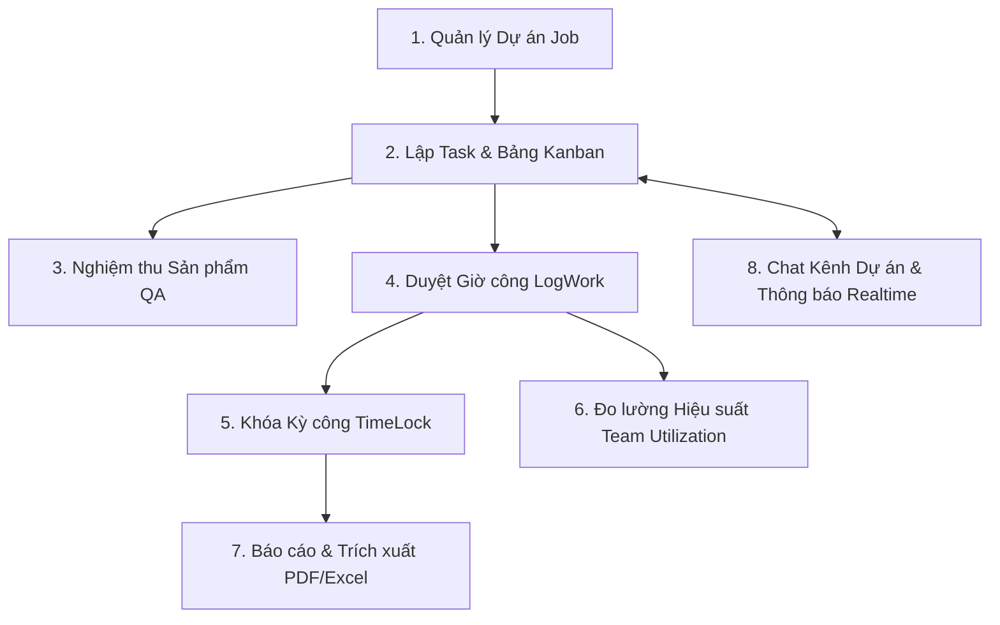

# 📑 TÀI LIỆU ĐẶC TẢ NGHIỆP VỤ VÀ KIẾN TRÚC PHÂN HỆ MANAGER
## HỆ THỐNG WORKTRACKER PRO (DJANGO REST FRAMEWORK + REACT VITE)

> **Tài liệu tham chiếu chuẩn:** Dành cho Project Manager, Đội ngũ Phát triển (Dev Backend/Frontend), Tester và Chuyên viên Đảm bảo Chất lượng.

---

## 🧭 PHẦN 1: NGUYÊN TẮC CỐT LÕI & PHẠM VI DỮ LIỆU (MANAGER SCOPE)

### 1.1. Quy tắc Xác định Phạm vi Dữ liệu (Data Scope Ownership)
Trong hệ thống WorkTracker Pro, phân hệ Manager hoạt động dựa trên cơ chế **Phân quyền 2 lớp (Double-layer Authorization)**:
1. **Lớp 1 - Action RBAC**: Quyền hành động được cấp qua bảng `roles`, `permissions`, `role_permissions` (ví dụ: `job:view`, `job:create`, `task:review`, `timesheet:review`, `timelock:lock`, `report:export`).
2. **Lớp 2 - Data Scope Isolation (Bắt buộc)**: Toàn bộ quyền truy xuất và thao tác dữ liệu của Manager bị giới hạn tuyệt đối bởi điều kiện:
   $$\text{jobs.manager\_id} == \text{request.user.id}$$

> ⚠️ **Lưu ý nghiệp vụ sống còn**:  
> Manager **chỉ có quyền** xem, tạo, sửa, duyệt và xuất báo cáo đối với các Dự án (Jobs), Công việc (Tasks), Bảng chấm công (LogWorks), Kỳ khóa sổ (TimeLocks) và Kênh Chat (Job Channels) thuộc các Job do chính Manager đó phụ trách.  
> **Tuyệt đối không dùng `departments.manager_id` để tính phạm vi dữ liệu** (trường này chỉ mang ý nghĩa cấu trúc danh bạ tổ chức của Admin).

---

## 🔄 PHẦN 2: BẢN ĐỒ 8 PHÂN HỆ NGHIỆP VỤ QUẢN LÝ CỦA MANAGER

---

### 📁 Phân hệ 1: Quản trị Dự án Chính (Job Management)
1. **Khởi tạo Dự án mới**:
   - Chọn Khách hàng đối tác (bắt buộc `Client.is_active = True`).
   - Hệ thống tự sinh mã dự án (`job_code`, VD: `ERP-2026-001`), gán mức độ ưu tiên (`HIGH`, `MEDIUM`, `LOW`).
   - Ràng buộc hợp lệ: $\text{Deadline} \ge \text{Start Date}$.
   - Tự động gán `manager = request.user`. Manager không thể tự chuyển giao quyền quản trị Job cho người khác (chỉ Admin mới được reassign).
2. **Máy trạng thái Dự án (Job State Machine)**:
   - Các trạng thái hợp lệ: `PLANNING` $\rightarrow$ `ACTIVE` $\rightarrow$ `ON_HOLD` / `COMPLETED` / `CANCELLED`.
   - **Điều kiện hoàn thành (`COMPLETED`)**: Bắt buộc **100% Task con** không bị hủy phải ở trạng thái `COMPLETED` và **không còn LogWork nào ở trạng thái `PENDING`**.
   - Bắt buộc nhập lý do giải trình khi chuyển Job sang `ON_HOLD` hoặc `CANCELLED`.
3. **Chỉ số Sức khỏe Dự án (Velocity-to-Deadline Forecast - VDF)**:
   - Hệ thống tự động tính tốc độ hoàn thành công việc thực tế mỗi ngày ($V = \frac{\text{Task Completed}}{\text{Days Elapsed}}$) để dự báo nguy cơ:
     - `ON_TRACK` (Xanh): Tiến độ đúng kế hoạch ($\text{Risk Ratio} \le 1.0$).
     - `AT_RISK` (Vàng): Có nguy cơ trễ hạn ($1.0 < \text{Risk Ratio} \le 1.25$).
     - `CRITICAL` (Đỏ): Nguy cơ trễ hạn nghiêm trọng ($\text{Risk Ratio} > 1.25$ hoặc vận tốc bằng 0).
     - `OVERDUE` (Đỏ đậm): Đã quá hạn chót.

---

### 📋 Phân hệ 2: Quản trị Công việc & Bảng Kanban (Task & Kanban Board)
1. **Giao việc (Task Delegation)**:
   - Tạo Task gắn vào Job đang `ACTIVE`, giao cho nhân viên trực thuộc (`assignee_id` có role `EMPLOYEE` đang hoạt động).
   - Ràng buộc tiến độ: $\text{Task.deadline} \le \text{Job.deadline}$.
2. **Kanban Board 5 Cột (`TODO` $\rightarrow$ `IN_PROGRESS` $\rightarrow$ `REVIEWING` $\rightarrow$ `COMPLETED` $\rightarrow$ `CANCELLED`)**:
   - **Kéo thả cùng cột (Reordering)**: Cập nhật vị trí thẻ bằng thuật toán chuỗi LexoRank (`order_index` với `key_between`) độ phức tạp $O(1)$ không gây quá tải CSDL.
   - **Kéo thả khác cột (Transition)**: Bắt buộc tuân thủ Ma trận chuyển đổi trạng thái Task (§8.1). Kéo sai luồng bị Backend từ chối ngay.
3. **Quản lý Tệp tin & Thảo luận**:
   - Tải tệp đính kèm Task (`TaskAttachment` hỗ trợ file an toàn nội bộ tối đa 20MB).
   - Bình luận (`TaskComment`) và danh sách người theo dõi (`TaskFollower`) để nhận thông báo tức thì.

---

### 🎯 Phân hệ 3: Nghiệm thu Sản phẩm Đầu ra (Deliverables QA / Task Review)
1. **Quy trình nộp bài an toàn của Nhân viên**:
   - Nhân viên khi hoàn thành công việc bấm **Submit for Review** (chuyển sang `REVIEWING`).
   - Đính kèm file sản phẩm vật lý nội bộ (`.zip`, `.pdf`, `.docx`,...) + Ghi chú giải trình bàn giao (Handover Note).
2. **Màn hình Nghiệm thu Tập trung (Split-View Review Queue)**:
   - **`APPROVE`**: Manager duyệt đạt $\rightarrow$ Task chuyển thành `COMPLETED`, lưu timestamp `completed_at`, bắn WebSocket chúc mừng nhân viên.
   - **`REJECT`**: Manager từ chối $\rightarrow$ Bắt buộc nhập lý do bắt sửa $\rightarrow$ Task tự động trả về `IN_PROGRESS`, hệ thống sinh bình luận cảnh báo màu đỏ loại `REJECTION_NOTE` và đẩy thông báo Toast cho nhân viên.
   - **`RE-OPEN / REWORK`**: Nếu Task đã Completed nhưng phát sinh lỗi trong thực tế, Manager có quyền mở lại về `IN_PROGRESS` hoặc `TODO` kèm lý do làm lại.

---

### ⏱️ Phân hệ 4: Duyệt & Hiệu chỉnh Giờ công (Timesheet & LogWork Review)
1. **Kiểm tra tính xác thực của Giờ làm**:
   - Nhân viên log giờ hàng ngày (kiểm soát trần $\le 24\text{h}$/ngày qua `DailyUserTimesheet`).
   - Bản ghi ban đầu ở trạng thái `PENDING`.
2. **4 Thao tác Xử lý của Manager**:
   - **`Approve`**: Xác nhận giờ công hợp lệ $\rightarrow$ Trạng thái `APPROVED` (chỉ giờ đã approved mới được tính vào báo cáo và đo lường nỗ lực dự án).
   - **`Reject`**: Từ chối bản ghi chấm công không đúng thực tế kèm lý do.
   - **`Correct`**: Manager trực tiếp sửa lại số giờ (`hours_spent`) hoặc mô tả kèm lý do điều chỉnh $\rightarrow$ Hệ thống tự động tính toán lại tổng giờ trong ngày tức thì.
   - **`Void`**: Vô hiệu hóa mềm bản ghi khai khống/nhập trùng $\rightarrow$ Trạng thái `VOIDED` (không xóa vật lý khỏi CSDL để phục vụ kiểm toán).

---

### 🔒 Phân hệ 5: Khóa Kỳ Chấm công (TimeLock Control)
1. **Khóa sổ cuối tháng (`Lock Month`)**:
   - Manager khóa kỳ công theo từng Job cụ thể (`lock_scope = 'JOB'`).
   - **Mục đích**: Đóng băng 100% dữ liệu giờ làm trong tháng của Job đó. Nhân viên không thể tạo mới, sửa hay xóa LogWork lùi về tháng đã khóa.
2. **Mở khóa kỳ công (`Unlock Period`)**:
   - Khi cần cho nhân viên bổ sung/sửa giờ công đặc biệt, Manager mở khóa và **bắt buộc nhập lý do mở khóa** (`unlock_reason`) để ghi vết kiểm toán (Audit Log).

---

### 👥 Phân hệ 6: Quản trị Đội ngũ & Tải công việc (Team Workload & Utilization)
1. **Theo dõi Hiệu suất & Tải công việc**:
   - Theo dõi tổng số giờ đã log của từng nhân viên trong tháng so với công suất chuẩn ($\text{Số ngày làm việc} \times 8\text{h}$).
   - **Chỉ số Tải công việc (Utilization Rate %)**:
     - $< 70\%$: **Normal** (Bình thường / Còn dư năng lực).
     - $70\% - 90\%$: **High** (Công suất cao).
     - $\ge 90\%$: **Overloaded** (Cảnh báo quá tải / Cần san sẻ bớt Task).
2. **Phân bổ phòng ban**: Manager có thể cập nhật phòng ban cho nhân viên trực thuộc (`assign-department`).

---

### 📊 Phân hệ 7: Báo cáo Phân tích & Trích xuất File (Analytics & Report Export)
1. **Manager Dashboard**:
   - Thẻ thống kê KPI: Số Job đang chạy, Task quá hạn, Tổng giờ đã duyệt, Số nhân sự quá tải.
   - Biểu đồ: Cơ cấu trạng thái Task (Donut Chart), Xu hướng giờ làm theo thời gian (Line Chart), Phân bổ nỗ lực theo dự án.
2. **Báo cáo chuyên sâu & Trích xuất file**:
   - *Báo cáo tổng hợp Task (Task Summary)*.
   - *Báo cáo chi tiết Timesheet (Timesheet Detail)* lọc đa tiêu chí.
   - Trích xuất dữ liệu sang định dạng **Excel (.xlsx)** hoặc **PDF (.pdf)** chứa đầy đủ mã dự án, tên khách hàng và chi tiết nghiệp vụ.

---

### 💬 Phân hệ 8: Trung tâm Trao đổi Thời gian thực (Chat & Realtime Hub)
1. **Kênh Chat Dự Án (Job Channels)**:
   - Tự động tạo kênh theo từng Job (`#JOB-01: Website Redesign`). Tự động thêm Manager và toàn bộ nhân viên được giao Task trong Job đó vào phòng chat.
   - **Chế độ Đóng băng Chỉ Đọc (Archived Read-Only)**: Khi Job chuyển sang `COMPLETED` hoặc `CANCELLED`, kênh chat tự động khóa ô nhập tin nhắn. Thành viên chỉ được xem lại lịch sử tri thức, không được gửi tin mới.
2. **Chat Trực tiếp 1-1 (Direct Messages)**: Trao đổi riêng tư giữa Manager và từng nhân viên (gửi file an toàn đến 20MB, hiển thị trạng thái đang gõ phím `typing`).
3. **Thông báo Thời gian thực (WebSockets `< 100ms`)**: Nhận chuông báo đỏ và Toast nảy góc ngay khi nhân viên nộp bài (`TASK_SUBMITTED`), có bình luận mới (`TASK_COMMENT`),...
