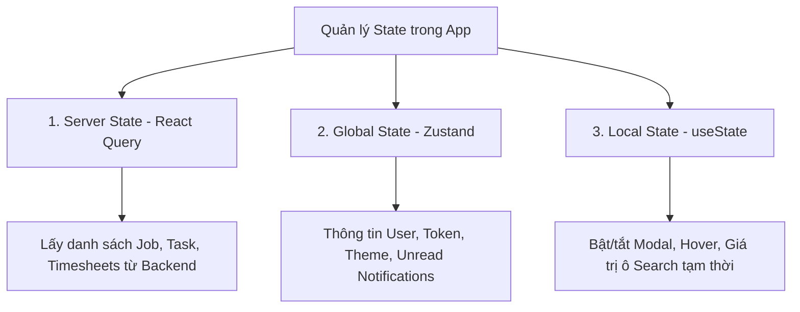

# 📐 HƯỚNG DẪN KIẾN TRÚC & PHƯƠNG PHÁP VIẾT COMPONENT DÙNG CHUNG (SHARED COMPONENTS)

> **Tài liệu:** Phương pháp lý luận thiết kế & Quy chuẩn viết code React Component  
> **Đường dẫn:** `docs/shared_component.md`  
> **Dự án:** WorkTracker Pro (Django REST Framework + React Vite)  
> **Đối tượng áp dụng:** Toàn bộ thành viên phát triển Frontend (Manager, Admin, Employee)

---

# 🧠 PHẦN 1: PHƯƠNG PHÁP LÝ LUẬN KHI VIẾT CODE COMPONENT (METHODOLOGY)

Khi bắt tay vào viết bất kỳ một Component UI nào trong hệ thống B2B SaaS chuyên nghiệp như WorkTracker Pro, chúng ta **KHÔNG VIẾT CODE THEO CẢM TÍNH HOẶC TỰ PHÁT**, mà phải tuân thủ nghiêm ngặt **4 NGUYÊN TẮC LÝ LUẬN CỐT LÕI** dưới đây. 

Tài liệu này giúp tất cả lập trình viên trong nhóm thống nhất tư duy, đảm bảo mã nguồn dễ đọc, dễ bảo trì, và không bị xung đột khi gộp code.

---

## 🎯 1. Nguyên tắc Đơn nhiệm (Single Responsibility Principle - SRP)

> *"Một Component chỉ nên có đúng một lý do duy nhất để thay đổi."*

### 💡 Lý luận kỹ thuật:
* Một Component nhỏ trong thư mục `src/components/common/` được coi là một **Dumb Component (Presenter Component)**. 
* Nhiệm vụ duy nhất của nó là:
  1. Nhận dữ liệu đầu vào qua `props`.
  2. Dựng giao diện người dùng (Render UI) thật đẹp, chuẩn thẩm mỹ.
  3. Bắn các sự kiện tương tác của người dùng ra ngoài thông qua các hàm callback (ví dụ: `onClick`, `onSelect`, `onChange`).

### ❌ Những điều TUYỆT ĐỐI TRÁNH:
* **KHÔNG** tự ý gọi API (`axios.get`, `fetch`) trực tiếp bên trong các linh kiện nhỏ như `StatusBadge`, `StatCard`, `InputField`, hay `DataTable`.
* **KHÔNG** chứa các logic nghiệp vụ phức tạp (Business Logic) thuộc về trang chính (Page).

### 📝 Ví dụ minh họa:
```jsx
// ❌ SAI: Component giao diện tự ý gọi API trực tiếp
function StatCard({ jobId }) {
  const [data, setData] = useState(null);
  useEffect(() => { axios.get(`/api/jobs/${jobId}/`).then(...) }, []); // SAI KHIẾN Bị PHỤ THUỘC API
  return <div>{data?.title}</div>;
}

// ✅ ĐÚNG: Component nhận props thuần túy, dễ tái sử dụng ở mọi nơi
function StatCard({ title, value, change, icon: Icon, trend = 'up' }) {
  return (
    <div className="p-5 bg-slate-900 border border-slate-800 rounded-xl shadow-sm hover:border-slate-700 transition-all">
      <div className="flex items-center justify-between">
        <span className="text-sm font-medium text-slate-400">{title}</span>
        {Icon && <Icon className="w-5 h-5 text-indigo-400" />}
      </div>
      <div className="mt-2 flex items-baseline gap-2">
        <span className="text-2xl font-bold text-slate-100">{value}</span>
        <span className={`text-xs font-semibold ${trend === 'up' ? 'text-emerald-400' : 'text-rose-400'}`}>
          {change}
        </span>
      </div>
    </div>
  );
}
```

---

## 🔄 2. Nguyên tắc Tái sử dụng Đa phân hệ (Multi-role Reusability)

> *"Viết một lần, sử dụng mượt mà ở cả 3 phân hệ Manager, Employee và Admin."*

### 💡 Lý luận kỹ thuật:
* Thư mục `src/components/common/` chứa các linh kiện nền tảng dùng chung cho toàn bộ dự án.
* Linh kiện phải được thiết kế dạng **Generic (Tổng quát)**, dựa trên cấu trúc `props` đầu vào linh hoạt thay vì viết cứng (hardcode) cho một màn hình cụ thể.

### 📝 Ví dụ minh họa:
Linh kiện `StatusBadge.jsx` nhận vào biến `status="IN_PROGRESS"`. Cho dù biến này đại diện cho:
- **Trạng thái Công việc (Task)** của Nhân viên.
- **Trạng thái Dự án (Job)** của Manager.
- **Trạng thái Tài khoản / Ticket** của Admin.

Huy hiệu badge vẫn tự động nhận diện và hiển thị màu sắc + nhãn tiếng Việt tương ứng:

```jsx
// ✅ ĐÚNG: Nhận bất kỳ status nào và tự mapper ra màu sắc/nhãn chuẩn
const STATUS_CONFIG = {
  TODO: { label: 'Cần làm', bg: 'bg-amber-500/10', text: 'text-amber-400', border: 'border-amber-500/20' },
  IN_PROGRESS: { label: 'Đang làm', bg: 'bg-blue-500/10', text: 'text-blue-400', border: 'border-blue-500/20' },
  REVIEWING: { label: 'Đang duyệt', bg: 'bg-purple-500/10', text: 'text-purple-400', border: 'border-purple-500/20' },
  COMPLETED: { label: 'Hoàn thành', bg: 'bg-emerald-500/10', text: 'text-emerald-400', border: 'border-emerald-500/20' },
  CANCELLED: { label: 'Đã hủy', bg: 'bg-rose-500/10', text: 'text-rose-400', border: 'border-rose-500/20' },
};

export default function StatusBadge({ status }) {
  const config = STATUS_CONFIG[status] || STATUS_CONFIG.TODO;
  return (
    <span className={`inline-flex items-center gap-1.5 px-2.5 py-1 text-xs font-medium rounded-full border ${config.bg} ${config.text} ${config.border}`}>
      <span className="w-1.5 h-1.5 rounded-full bg-current" />
      {config.label}
    </span>
  );
}
```

---

## 🧩 3. Nguyên tắc Phân tách 3 Tầng State (State Separation)

> *"Đặt State đúng vị trí để tránh Re-render thừa và tràn bộ nhớ."*

Trong ứng dụng WorkTracker Pro, dữ liệu được chia làm **3 tầng State rạch ròi**:



| Tầng State | Thư viện quản lý | Ví dụ áp dụng | Khi nào sử dụng? |
| :--- | :--- | :--- | :--- |
| **1. Server State** | `@tanstack/react-query` | Danh sách Jobs, Tasks, Timesheets, Báo cáo | Tất cả dữ liệu lưu trữ ở Database Backend cần cache & tự động đồng bộ. |
| **2. Global State** | `Zustand` | User Profile, Access Token, Subscriptions, Unread Count | Dữ liệu dùng chung cho toàn bộ các trang trong App. |
| **3. Local State** | React `useState` / `useReducer` | Bật/Tắt Pop-up Modal, ô gõ từ khóa tìm kiếm tạm thời | Dữ liệu chỉ có giá trị nội bộ bên trong 1 Component duy nhất. |

---

## 🎨 4. Nguyên tắc Thẩm mỹ Cao cấp (Rich Aesthetics & Accessibility)

> *"Giao diện phải tạo ấn tượng ngỡ ngàng (WOW Effect) ngay từ cái nhìn đầu tiên."*

### 💡 Quy chuẩn thiết kế (Design System Rules):
1. **Hệ màu chủ đạo (Tailored Dark Palette):**
   - Background chính: `#0F172A` (`bg-slate-900`)
   - Card / Sidebar Container: `#1E293B` (`bg-slate-800/80`)
   - Viền khung: `border-slate-700/60`
   - Màu chữ chính: `text-slate-100` (Trắng xám)
   - Màu chữ phụ: `text-slate-400` (Xám nhạt)
2. **Typography:** Sử dụng Font **Inter** hoặc **Outfit** từ Google Fonts.
3. **Hiệu ứng Micro-animations:**
   - Tất cả nút bấm và thẻ tương tác đều phải có class: `transition-all duration-200 hover:scale-[1.01] active:scale-[0.99]`.
4. **Hỗ trợ truy cập (Accessibility / ARIA):**
   - Mọi nút bấm icon không chữ phải có `aria-label` cho trình đọc màn hình.
   - Hỗ trợ phím `Esc` để đóng Modal và phím `Tab` để di chuyển focus.

---

# 🔜 CÁC BƯỚC TIẾP THEO
Tài liệu này sẽ tiếp tục được cập nhật phần phân tích chi tiết kỹ thuật cho từng nhóm Component dùng chung (`layout`, `cards`, `table`, `badges`, `drawer`, `charts`, `forms`, `feeds`, `profile`) ở các phiên bản tiếp theo.
